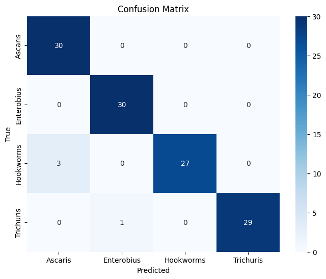

# 🦠 Intestinal Parasite Classification – Lightweight CNN (EfficientNetB0)

A lightweight Convolutional Neural Network using **EfficientNetB0** for the classification of intestinal parasite eggs in microscopic images.  
Designed for **accuracy, efficiency, and deployment on resource-constrained devices**.

---

## 📌 Overview
This project tackles the challenge of detecting and classifying intestinal parasites from microscopic stool images.  
By leveraging **transfer learning** with **EfficientNetB0**, the model achieves **high accuracy** while staying lightweight and efficient.  

**Target Classes:**
-  *Ascaris lumbricoides* (Roundworm)  
-  *Enterobius vermicularis* (Pinworm)  
-  Hookworm eggs (*Ancylostoma duodenale*, *Necator americanus*)  
-  *Trichuris trichiura* (Whipworm)  

---

## 📂 Dataset
Microscopic egg images were **resized to 224×224** (EfficientNetB0 input size).  
Images were first **loaded as grayscale**, then expanded to **3-channel RGB** for compatibility.  
Pixel values were normalized to **[0,1]**.

```sql
dataset/
├── train/
│ ├── ascaris_lumbricoides/
│ ├── enterobius_vermicularis/
│ ├── hookworms/
│ └── trichuris_trichiura/
│
└── val/
├── ascaris_lumbricoides/
├── enterobius_vermicularis/
├── hookworms/
└── trichuris_trichiura/
```

## 🚀 Training Pipeline

Key steps in training:

- **Data Augmentation** (rotation, zoom, shift, flips)  
- **Grayscale → RGB preprocessing**  
- **Transfer Learning** with EfficientNetB0  
- **Fine-tuning** last 30 layers after initial training  
- **Callbacks:** EarlyStopping, ReduceLROnPlateau, ModelCheckpoint  

### training loop
```python
checkpoint = ModelCheckpoint("efficientnet_parasite.h5", save_best_only=True, monitor="val_accuracy", mode="max")
earlystop = EarlyStopping(patience=5, restore_best_weights=True)

history = model.fit(
    train_gen_processed,
    validation_data=val_gen_processed,
    epochs=30,
    callbacks=[checkpoint, earlystop],
    steps_per_epoch=train_gen.samples // BATCH_SIZE,
    validation_steps=val_gen.samples // BATCH_SIZE
)
```
## 📊 Results

**Final Test Set (120 images, 30 per class):**

| Class        | Precision | Recall | F1-Score | Support |
|--------------|-----------|--------|----------|---------|
| 🟢 Ascaris   | 0.9091    | 1.0000 | 0.9524   | 30      |
| 🟡 Enterobius| 0.9677    | 1.0000 | 0.9836   | 30      |
| 🔴 Hookworms | 1.0000    | 0.9000 | 0.9474   | 30      |
| 🟣 Trichuris | 1.0000    | 0.9667 | 0.9831   | 30      |

**Overall Performance:**

- ✅ Accuracy: **96.7%**  
- ✅ Macro F1-score: **0.97**  
- ✅ Weighted Avg F1-score: **0.97**




