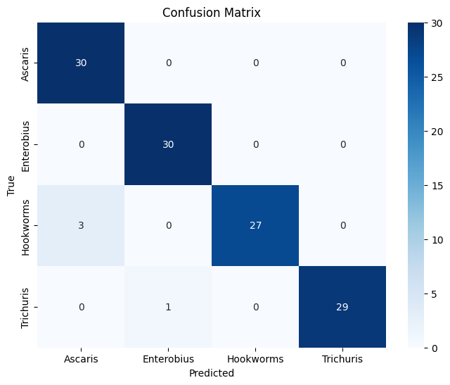

# Intestinal Parasite Classification – Lightweight CNN (EfficientNetB0)

A lightweight Convolutional Neural Network using **EfficientNetB0** for the classification of intestinal parasite eggs in microscopic images.  
Designed for **accuracy, efficiency, and deployment on resource-constrained devices** like the Raspberry Pi 5.

---

##  Overview

This project tackles the challenge of detecting and classifying intestinal parasites from microscopic stool images.  
By leveraging **transfer learning** with **EfficientNetB0**, the model achieves **high accuracy** while staying lightweight and efficient.

**Target Classes:**

- _Ascaris lumbricoides_ (Roundworm)
- _Enterobius vermicularis_ (Pinworm)
- Hookworm eggs (_Ancylostoma duodenale_, _Necator americanus_)
- _Trichuris trichiura_ (Whipworm)

---

## Raspberry Pi 5 Deployment

This application is optimized for the **Raspberry Pi 5** with the **official 7" Touchscreen** (800x480) and **Camera Module 3 / HQ Camera**.

### Features

- **Touch-Friendly UI**: Large buttons, dark mode, and full-screen overlay results.
- **Autostart**: Automatically launches on boot.
- **Hardware Accelerated**: Uses `picamera2` for low-latency preview.

### Installation & Setup

1.  **Clone the Repository**:

    ```bash
    cd ~
    git clone https://github.com/AtlastDeepLearning/Intestinal-Parasite-Classification-LW-CNN.git thesis
    cd thesis
    ```

2.  **Run the Setup Script**:
    This installs system dependencies, creates a virtual environment, and installs Python libraries.

    ```bash
    chmod +x scripts/*.sh
    ./scripts/pi_env_setup.sh
    ```

    _(Note: This takes 10-20 minutes)_

3.  **Configure Autostart (Optional)**:
    To make the app run automatically when the Pi turns on:
    ```bash
    ./scripts/setup_autostart.sh
    ```
    Reboot to test: `sudo reboot`

### Usage

**Manual Launch**:

```bash
./scripts/pi_run_app.sh
```

**Interface Controls**:

- **Start Camera**: Activates the live video feed.
- **Capture**: Freezes the current frame.
- **Crop**: Draw a box around the parasite on the touchscreen.
- **Analyze**: Runs the AI model on the cropped area. Results appear in a large popup.
- **Exit**: Closes the application (or press `ESC` on a keyboard).

---

## Dataset Structure

Microscopic egg images were **resized to 224×224** (EfficientNetB0 input size).  
Images were first **loaded as grayscale**, then expanded to **3-channel RGB** for compatibility.  
Pixel values were normalized to **[0,1]**.

```sql
dataset/
├── train/
│ ├── ascaris_lumbricoides/
│ ├── enterobius_vermicularis/
│ ├── hookworms/
│ └── trichuris_trichiura/
│
└── val/
├── ascaris_lumbricoides/
├── enterobius_vermicularis/
├── hookworms/
└── trichuris_trichiura/
```

---

## Results

**Final Test Set (120 images, 30 per class):**

| Class         | Precision | Recall | F1-Score | Support |
| ------------- | --------- | ------ | -------- | ------- |
| 🟢 Ascaris    | 0.9091    | 1.0000 | 0.9524   | 30      |
| 🟡 Enterobius | 0.9677    | 1.0000 | 0.9836   | 30      |
| 🔴 Hookworms  | 1.0000    | 0.9000 | 0.9474   | 30      |
| 🟣 Trichuris  | 1.0000    | 0.9667 | 0.9831   | 30      |

**Overall Performance:**

- Accuracy: **96.7%**
- Macro F1-score: **0.97**
- Weighted Avg F1-score: **0.97**



---

## Troubleshooting

**Camera Error: `numpy.dtype size changed`**  
This is a version mismatch between system `picamera2` and the virtual environment's `numpy`.
**Fix**:

```bash
# Downgrade Numpy in the environment
source ~/thesis/tf-env/bin/activate
pip install "numpy<2.0"
pip install "opencv-python<4.10"
```

**UI Not Centered**  
The app is designed for 800x480 screens. If it looks wrong:

- Ensure you are using the official Raspberry Pi Touchscreen.
- The app uses `overrideredirect(True)` to force position to (0,0).
